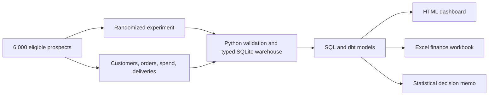

# Baltic Commerce Intelligence

[](https://github.com/RidhanPar/baltic-commerce-intelligence/actions/workflows/test.yml)

Market analytics platform tracking retail and logistics trends across Baltic e-commerce markets (Estonia, Latvia, Lithuania). Built to support strategic planning decisions with automated data pipelines and executive-ready dashboards.

An end-to-end analytics case study answering:

> Which acquisition channels create profitable growth, and should a free-shipping offer be launched?


**Review the deliverables:** [Live dashboard](https://ridhanpar.github.io/baltic-commerce-intelligence/) | [Download the real Excel workbook](artifacts/Baltic_Commerce_Analysis.xlsx) | [Read the decision memo](docs/analysis.md)

## Baltic Region Context

Built with an understanding of Baltic business dynamics — including seasonal e-commerce peaks, cross-border logistics patterns, and regional market differences. Designed for teams operating across Riga, Tallinn, and Vilnius.

## Decision Summary

Analysis of 6,000 eligible prospects across Latvia, Lithuania, and Estonia found:

- The free-shipping treatment increased conversion by **3.76 percentage points** (95% CI: **+1.43 to +6.09pp**, p=0.0016), but reduced contribution margin by **EUR 1.08 per eligible prospect**. Recommendation: **redesign, do not launch**.
- **CRM** and **Organic Search** produced the strongest profit per prospect. **Paid Search** converted well but lost EUR 3.0k after acquisition and variable costs, showing why conversion alone is insufficient.
- **FastShip** delivered the strongest on-time service, while lower-cost carriers showed meaningful service tradeoffs by market.

## What Runs

The local pipeline is fully reproducible and uses Python, SQL, SQLite, dbt, Excel, HTML, and GitHub Actions:

```powershell
python -m pip install -r requirements.txt
./run.ps1
```

It regenerates the synthetic source data, creates a typed analytical warehouse, produces decision marts, builds the dashboard and Excel workbook, runs the Python quality suite, loads dbt seeds, and validates five dbt models.

Key outputs:

- [`docs/index.html`](docs/index.html): source for the live executive dashboard
- [`artifacts/Baltic_Commerce_Analysis.xlsx`](artifacts/Baltic_Commerce_Analysis.xlsx): real Excel workbook with formulas, tables, filters, conditional formatting, chart, data dictionary, and executive decision page
- [`data/processed/experiment.csv`](data/processed/experiment.csv): experiment results and statistical evidence
- [`data/processed/channel_profitability.csv`](data/processed/channel_profitability.csv): acquisition funnel and profitability
- [`docs/analysis.md`](docs/analysis.md): decision memo

## Architecture



## Evidence by Skill

| Capability | Runnable evidence |
|---|---|
| SQL and data modeling | Typed star-schema warehouse, foreign keys, profitability and logistics marts |
| Python | Deterministic data generation, ETL, experiment inference, dashboard and workbook automation |
| dbt | Runnable SQLite project with staging/mart models, documentation, and ten tests |
| Statistics | Intention-to-treat conversion lift, confidence interval, p-value, margin lift, and sample-ratio mismatch check |
| Excel | Downloadable `.xlsx` workbook with formulas, structured tables, filters, navigation, conditional formatting, chart, and executive decision page |
| Data quality and CI | Python pipeline tests plus dbt build in GitHub Actions |
| Business communication | Executive dashboard, decision memo, methodology, caveats, and interview guide |

The Power BI folder contains a documented semantic-model design and DAX measures. It is supporting evidence, not a claim that a `.pbix` report was deployed.

No LLM or autonomous agent is used in the analytical pipeline. The calculations, statistical tests, dashboard, memo, and workbook are deterministic and reproducible from the generated source data.

## Repository Map

```text
python/          Data generation, typed ETL, statistics, dashboard, Excel
dbt/             Runnable dbt project, models, tests, and seed loader
sql/             Analytical SQL examples
tests/           Data quality, reconciliation, schema, and artifact tests
artifacts/       Recruiter-ready real Excel workbook
data/processed/  Small decision marts; raw data is regenerated locally
docs/            Live dashboard, decision memo, and methodology
powerbi/         DAX measures and semantic-model design
```

## Methodology and Limits

The data is synthetic, deterministic, and designed to require multi-factor analysis rather than encode a single obvious answer. Treatment assignment is randomized before purchase, and both cohorts contain converters and non-converters. Full assumptions are documented in [`docs/synthetic-data-methodology.md`](docs/synthetic-data-methodology.md).

Generated raw CSVs and warehouse files are intentionally excluded from Git because the one-command pipeline recreates them. This keeps the public repository focused on code, validated outputs, and decisions.

## Resume Bullets

- Built a reproducible commerce analytics platform using Python, SQL, dbt, SQLite, Excel, and GitHub Actions, with a typed warehouse, 19 automated data tests, and generated executive reporting.
- Evaluated a randomized offer across 6,000 eligible prospects, finding statistically significant conversion lift but a EUR 1.08 decline in margin per prospect, leading to a redesign recommendation.
- Identified profitable CRM and Organic Search growth alongside a high-conversion but loss-making Paid Search channel by modeling acquisition, refunds, and delivery costs.
