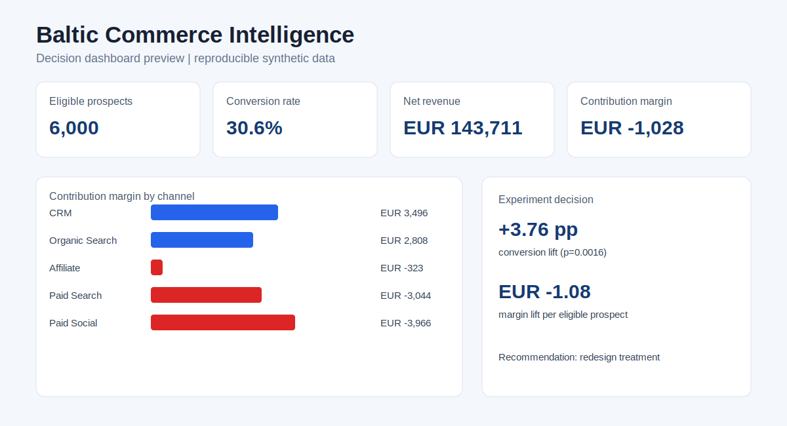
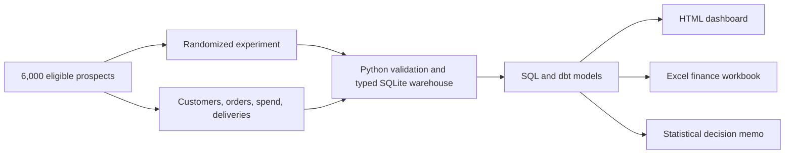

# Baltic Commerce Intelligence

[](https://github.com/RidhanPar/baltic-commerce-intelligence/actions/workflows/test.yml)

An end-to-end analytics case study answering:

> Which acquisition channels create profitable growth, and should a free-shipping offer be launched?



## Decision Summary

Analysis of 6,000 eligible prospects across Latvia, Lithuania, and Estonia found:

- The free-shipping treatment increased conversion by **3.76 percentage points** (95% CI: **+1.43 to +6.09pp**, p=0.0016), but reduced contribution margin by **EUR 1.08 per eligible prospect**. Recommendation: **redesign, do not launch**.
- **CRM** and **Organic Search** produced the strongest profit per prospect. **Paid Search** converted well but lost EUR 3.0k after acquisition and variable costs, showing why conversion alone is insufficient.
- **FastShip** delivered the strongest on-time service, while lower-cost carriers showed meaningful service tradeoffs by market.

Open the [live executive dashboard](https://ridhanpar.github.io/baltic-commerce-intelligence/) or the repository copy at [`artifacts/dashboard.html`](artifacts/dashboard.html).

## What Runs

The local pipeline is fully reproducible and uses Python, SQL, SQLite, dbt, Excel, HTML, and GitHub Actions:

```powershell
python -m pip install -r requirements.txt
./run.ps1
```

It regenerates the synthetic source data, creates a typed analytical warehouse, produces decision marts, builds the dashboard and Excel workbook, runs eight Python quality tests, loads dbt seeds, and runs five dbt models with ten dbt tests.

Key outputs:

- [`artifacts/dashboard.html`](artifacts/dashboard.html): executive decision dashboard
- [`artifacts/finance_analysis.xlsx`](artifacts/finance_analysis.xlsx): formatted finance workbook
- [`data/processed/experiment.csv`](data/processed/experiment.csv): experiment results and statistical evidence
- [`data/processed/channel_profitability.csv`](data/processed/channel_profitability.csv): acquisition funnel and profitability
- [`docs/analysis.md`](docs/analysis.md): decision memo

## Architecture



## Evidence by Skill

| Capability | Runnable evidence |
|---|---|
| SQL and data modeling | Typed star-schema warehouse, foreign keys, profitability and logistics marts |
| Python | Deterministic data generation, ETL, experiment inference, dashboard and workbook automation |
| dbt | Runnable SQLite project with staging/mart models, documentation, and ten tests |
| Statistics | Intention-to-treat conversion lift, confidence interval, p-value, margin lift, and sample-ratio mismatch check |
| Excel | Generated finance workbook with formatted tables, filters, frozen panes, KPIs, and chart |
| Data quality and CI | Eight pipeline tests plus dbt build in GitHub Actions |
| Business communication | Executive dashboard, decision memo, methodology, caveats, and interview guide |

The repository also includes implementation blueprints for Power BI/DAX, Snowflake, Databricks, Looker, and R. These show how the validated core model maps to those platforms; they are **not presented as deployed production systems**. See [`docs/platform-extensions.md`](docs/platform-extensions.md).

## Repository Map

```text
python/          Data generation, typed ETL, statistics, dashboard, Excel
dbt/             Runnable dbt project, models, tests, and seed loader
sql/             Analytical SQL examples
tests/           Data quality, reconciliation, schema, and artifact tests
artifacts/       Generated dashboard and Excel workbook
data/            Reproducible raw sources, marts, and local warehouse
docs/            Decision memo, methodology, architecture, and interview guide
powerbi/         DAX measures and report implementation guide
snowflake/       Warehouse and access-control blueprint
databricks/      Bronze/Silver pipeline blueprint
looker/          Governed semantic-model blueprint
r/               Independent experiment-analysis implementation
```

## Methodology and Limits

The data is synthetic, deterministic, and designed to require multi-factor analysis rather than encode a single obvious answer. Treatment assignment is randomized before purchase, and both cohorts contain converters and non-converters. Full assumptions are documented in [`docs/synthetic-data-methodology.md`](docs/synthetic-data-methodology.md).

This project demonstrates analytical judgment and implementation ability. It does not claim results from a real company or production experience with every platform represented.

## Resume Bullets

- Built a reproducible commerce analytics platform using Python, SQL, dbt, SQLite, Excel, and GitHub Actions, with a typed warehouse, 18 automated data tests, and generated executive reporting.
- Evaluated a randomized offer across 6,000 eligible prospects, finding statistically significant conversion lift but a EUR 1.08 decline in margin per prospect, leading to a redesign recommendation.
- Identified profitable CRM and Organic Search growth alongside a high-conversion but loss-making Paid Search channel by modeling acquisition, refunds, and delivery costs.
