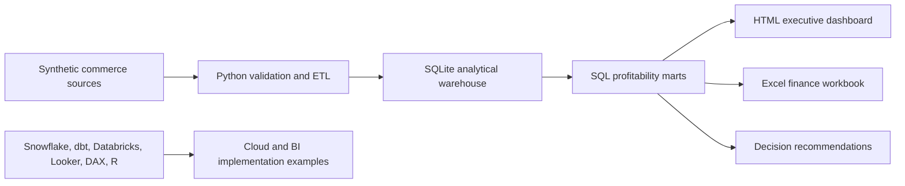

# Baltic Commerce Intelligence


An end-to-end data analytics portfolio project that answers:

> Which acquisition channels create profitable, repeatable growth after marketing, refunds, and delivery costs?

The project is designed around recurring data analyst requirements found in Latvian CV.lv vacancies: SQL, Python, Power BI/DAX, Excel, data modeling, ETL, data quality, experimentation, Snowflake, Databricks, Looker, dbt, Git, and stakeholder communication.

## Business Results

Analysis of the reproducible synthetic 2025 dataset found:

- **Organic Search and CRM generate €11.8k of contribution margin** and margin rates above 13%.
- **Paid Social loses €6.6k**, with a -14.8% contribution-margin rate.
- **EconomyBox delivers only 78.5% of orders on time**, versus 95.8% for FastShip.
- The free-shipping treatment produces lower margin per assigned customer than control in the generated experiment dataset.

**Recommendation:** Reallocate low-quality Paid Social spend toward Organic Search and CRM, investigate EconomyBox lanes, and do not launch the free-shipping treatment without redesigning and retesting it.

## Dashboard

Open [`artifacts/dashboard.html`](artifacts/dashboard.html) for the generated executive dashboard.

The pipeline also creates:

- [`artifacts/finance_analysis.xlsx`](artifacts/finance_analysis.xlsx): formatted Excel analysis workbook
- [`data/processed/channel_profitability.csv`](data/processed/channel_profitability.csv): channel profitability mart
- [`data/processed/logistics.csv`](data/processed/logistics.csv): carrier performance mart
- [`data/processed/experiment.csv`](data/processed/experiment.csv): experiment result mart

## Architecture



The runnable local version uses SQLite so reviewers can reproduce it without paid accounts. Cloud-ready examples demonstrate how the same model maps to Snowflake, dbt, Databricks, Looker, Power BI/DAX, and R.

## Run Locally

Requirements: Python 3.10+ and `openpyxl`.

```powershell
python -m pip install -r requirements.txt
python python/generate_data.py
python python/run_pipeline.py
python -m unittest discover -s tests -v
```

Or on Windows:

```powershell
./run.ps1
```

The generator uses a fixed seed, making all outputs deterministic and testable.

## Repository Structure

```text
artifacts/       Generated HTML dashboard and Excel workbook
data/raw/        Five realistic source-system extracts
data/processed/  Analytical marts and local SQLite warehouse
python/          Data generation, validation, ETL, dashboard, and Excel code
sql/             Advanced analytical SQL
tests/           Data-quality and reconciliation tests
dbt/             dbt mart and schema tests
powerbi/         DAX measures
looker/          LookML semantic model
snowflake/       Warehouse and role setup
databricks/      Clickstream pipeline example
r/               Experiment-analysis example
docs/            Analysis, architecture, CV.lv research, and resume bullets
```

## Skills Demonstrated

| Skill | Evidence |
|---|---|
| SQL | Analytical marts, cohort logic, window functions, profitability analysis |
| Python | Deterministic data generation, ETL, validation, dashboard and Excel automation |
| Data quality | Unique-key, reconciliation, artifact, and CI tests |
| Excel | Generated executive workbook with formatted tables and chart |
| Power BI / DAX | Reusable measures for revenue, margin, retention, and YoY |
| R / statistics | Intention-to-treat experiment analysis |
| Snowflake / dbt | Layered warehouse, roles, modular model, schema tests |
| Databricks | Bronze/Silver clickstream pipeline with quality expectations |
| Looker | Governed profitability dimensions and measures |
| Business analysis | Quantified findings, recommendations, and explicit caveats |

## Resume Bullets

- Built an end-to-end Baltic e-commerce analytics platform using Python, SQL, dbt-style modeling, Power BI/DAX, Excel, Snowflake, Databricks, Looker, and R.
- Modeled and analyzed 3,891 synthetic orders across three markets, identifying a €6.6k Paid Social loss and profitable Organic Search and CRM opportunities.
- Automated a tested pipeline that produces an analytical warehouse, executive HTML dashboard, Excel finance workbook, and decision-ready marts.

## Important Note

All commercial data is synthetic and generated by the repository. Findings demonstrate analytical methodology and portfolio capability, not results from a real company.

